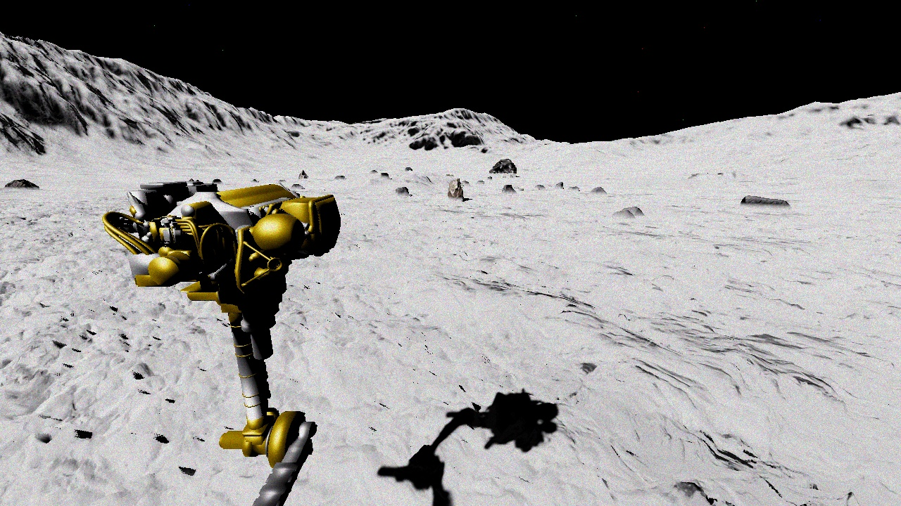
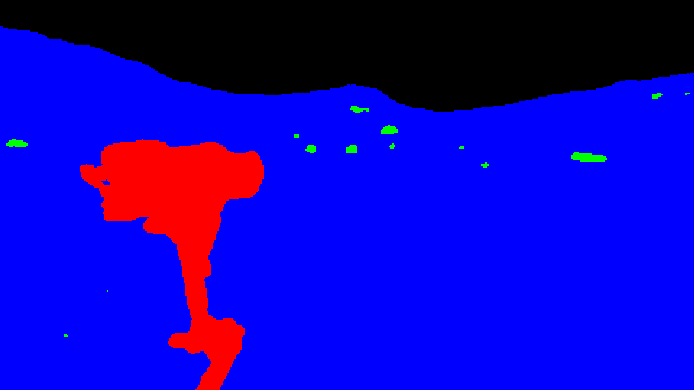

# Lunar rocks segmentation

It's a university project based on artificial neural network and is used to lunar rocks segmentation. Software is written in **Python** programming language using the open source machine learning framework **PyTorch**.

## Scripts

- lunar_seg.py - it's a script to train segmentation model
- predict.py - it's a script to predict results 

## Prediction

Original image:

Predicted image:

